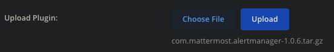
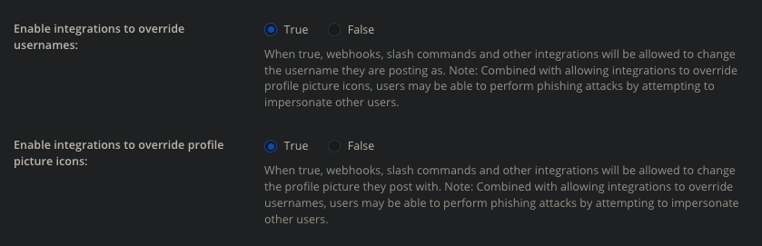
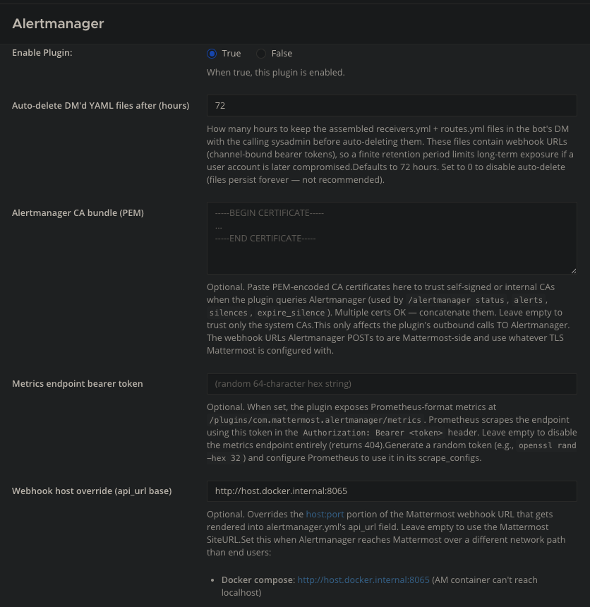
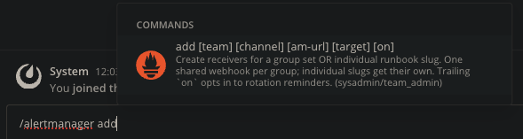
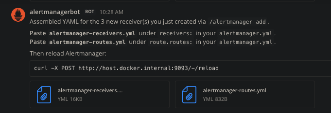
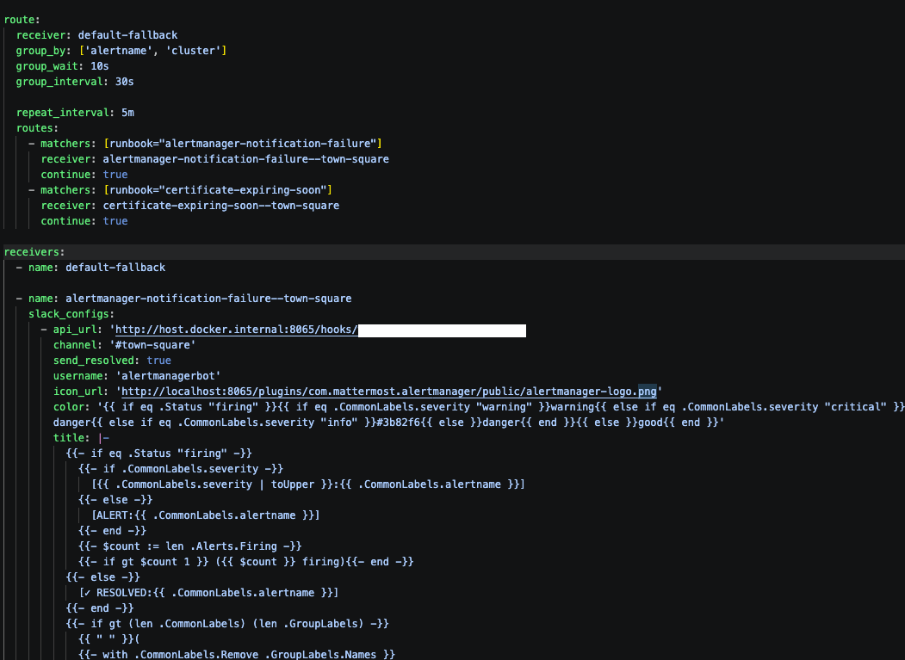
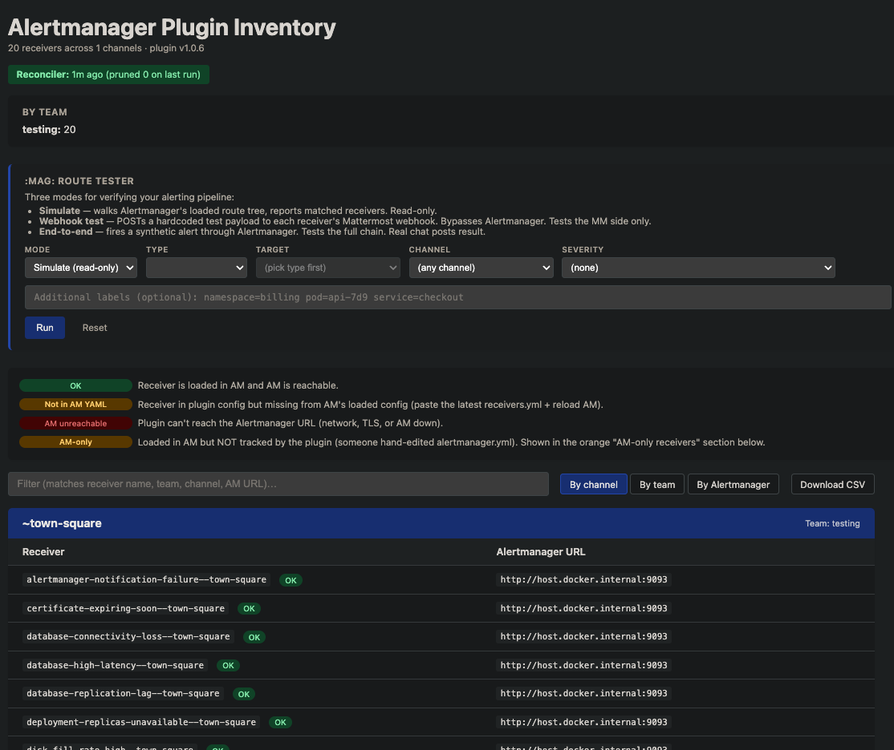
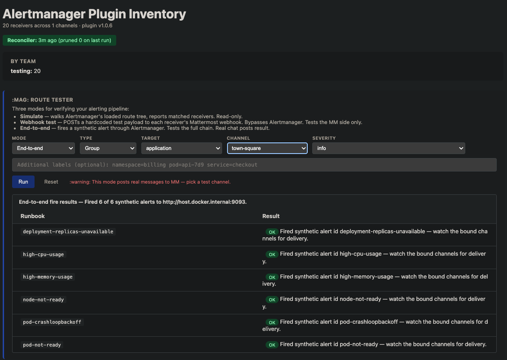
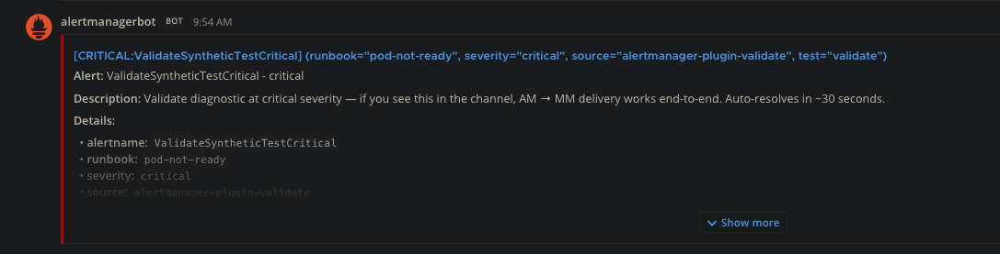
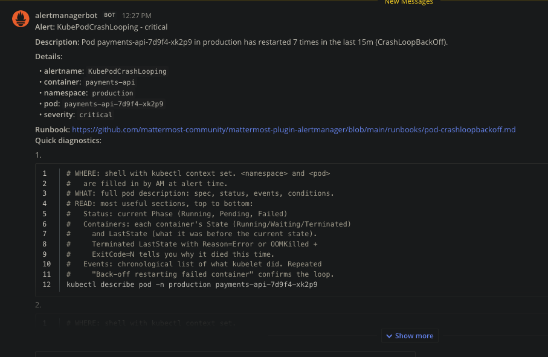

<!--
IMAGE GUIDE (for whoever captures the screenshots)
==================================================
Each `` below has a shot spec in the HTML comment
directly above it:
  SHOT      — what to frame
  HIGHLIGHT — what to circle / annotate
  REDACT    — secrets to blur BEFORE capturing (this plugin's screenshots
              contain real secrets — do not publish live values)

Put PNGs in docs/images/ (for this Markdown) and mirror them into
public/help/images/ so the rendered in-plugin help shows them too.

⚠ REDACTION IS MANDATORY. A Mattermost incoming-webhook URL *is* its own
auth (the hook ID is the credential). Also redact: MetricsToken, real
hostnames/IPs, org team & channel names, user emails.
-->

# Alertmanager plugin — Setup & first alert

This guide takes you from a fresh install to a real Prometheus alert landing
in a Mattermost channel with copy-paste-runnable diagnostics. It touches two
systems; every step is tagged **[Mattermost]** or **[Alertmanager]** so you
always know which one you're in.

## How it fits together

```
 [Prometheus]                 [Alertmanager]                 [Mattermost]
 rules fire  ──alerts──▶  routes to a receiver ──POST──▶  incoming webhook
                                                          /hooks/<id>
                                                             │
                                                             ▼
                                              channel post + runbook diagnostics
                                              (kubectl cmds, ns/pod filled in)

 The plugin GENERATES the Alertmanager receiver config and OWNS the webhook.
 You paste that config into your Alertmanager. One handoff.

 (optional)  [Prometheus] ──scrape──▶ plugin /metrics   [Bearer: MetricsToken]
```

The single most important idea: **the plugin doesn't receive alerts from
Prometheus directly.** It hands you an Alertmanager receiver (a webhook URL +
a message template), you wire that into Alertmanager, and Alertmanager posts
the rendered alert to Mattermost.

## Prerequisites

- **[Mattermost]** System Admin access, server v10.5+.
- **[Alertmanager]** A running Prometheus + Alertmanager you can edit and reload.
- For the runbook `kubectl` commands to be *runnable*, alerts need a
  `namespace` (and usually `pod`) label — see Step 6.

---

## Step 1 — Install & enable the plugin  **[Mattermost]**

Download the release **asset** — `com.mattermost.alertmanager-<version>.tar.gz`
from the release's **Assets** — and upload it in **System Console → Plugins →
Plugin Management**. Enable it.

> ⚠ **Do not** download the "Source code (zip/tar.gz)" link. That's the repo
> source: it has no compiled binaries and its URLs are unsubstituted
> placeholders. Only the **Assets** bundle is a working plugin.

<!-- SHOT: System Console → Plugin Management → Upload Plugin, file picker showing the release .tar.gz | HIGHLIGHT: circle the "Assets" .tar.gz; cross out the "Source code" link | REDACT: none -->


Then turn on username/icon overrides so alert posts render as
`@alertmanagerbot`, in **System Console → Integrations → Integration
Management**:

<!-- SHOT: Integration Management page | HIGHLIGHT: "Enable integrations to override usernames" = true AND "...override profile picture icons" = true | REDACT: none -->


---

## Step 2 — (Optional) plugin settings  **[Mattermost]**

**System Console → Plugins → Alertmanager.** All optional — defaults work for
a basic setup.

| Setting | What it does | When you need it |
|---|---|---|
| **Webhook host override** | Replaces the host in the generated `api_url` so Alertmanager can reach Mattermost over a different network path | Docker/K8s where AM can't hit your SiteURL (see [KUBERNETES.md](KUBERNETES.md)) |
| **Alertmanager CA bundle (PEM)** | Trust bundle for a TLS Alertmanager | AM served over HTTPS with a private CA |
| **Metrics endpoint bearer token** | Auth for the plugin's `/metrics` endpoint | Only if Prometheus will scrape the plugin — see Step 8 |
| **Auto-delete DM'd YAML after (hours)** | TTL on exported config files DM'd to you | Tighten if the YAML embeds sensitive hosts |
| **Webhook rotation reminder (days)** | Nudges to rotate webhooks | Opt-in per receiver with the `on` flag on `add` |

<!-- SHOT: the Alertmanager plugin settings page | HIGHLIGHT: the 5 fields above | REDACT: MetricsToken value, any real hostnames in Webhook host / CA bundle -->


---

## Step 3 — Bind a channel to alerts  **[Mattermost]**

In the channel where you want alerts, run:

```
/alertmanager add <team> <channel> <alertmanager-url> <target>
```
- `<target>` is a **runbook set** (`all`, `compute`, `application`, `database`,
  `storage`, `networking`, `observability`, `security`) or a **single runbook slug**
  (e.g. `pod-crashloopbackoff`).
- Add a trailing `on` to opt these receivers into rotation reminders.

Example:
```
/alertmanager add sre-team incidents http://alertmanager.monitoring:9093 compute
```
This creates the Mattermost incoming webhook and registers the receivers.
`/alertmanager list` shows what's bound to the current channel.

<!-- SHOT: message box with "/alertmanager add " typed and the slash-command autocomplete hint visible | HIGHLIGHT: the argument hint [team] [channel] [am-url] [target] | REDACT: real team/channel names, real AM URL -->


---

## Step 4 — Get the Alertmanager config  **[Mattermost]**

```
/alertmanager export
```
The bot DMs you `alertmanager-receivers.yml` and `alertmanager-routes.yml` for
this channel. Inside you'll find the receiver (with the webhook URL) and its
`slack_configs` text template — the runbook's `kubectl` diagnostics with
`{{ .Labels.namespace }}` / `{{ .Labels.pod }}` placeholders that Alertmanager
fills at alert time.

> The receiver is a `slack_configs` block, not `webhook_configs`. Mattermost's
> incoming webhook speaks the Slack payload format, so Alertmanager's Slack
> receiver posts to it directly — no adapter needed.

<!-- SHOT: the bot's DM showing receivers.yml + routes.yml attachments | HIGHLIGHT: the two attached files | ⚠ REDACT: the webhook URL inside any previewed YAML — it's a live credential -->


---

## Step 5 — Wire it into Alertmanager  **[Alertmanager]**

Paste the exported `receivers:` and `route:` blocks into your `alertmanager.yml`,
then reload Alertmanager (`SIGHUP`, `POST /-/reload`, or your operator's
reload). If AM is HTTPS with a private CA, set the **CA bundle** setting
(Step 2). If AM can't reach your SiteURL, set the **Webhook host override**.

<!-- SHOT: alertmanager.yml in an editor with the pasted receiver + route | HIGHLIGHT: annotate "webhook URL here" and "runbook template here ({{ .Labels.namespace }})" | ⚠ REDACT: the webhook URL / api_url value -->


---

## Step 6 — Emit the labels the runbooks render from  **[Prometheus]**

The diagnostic commands are only *runnable* if the alert carries the labels
they reference. For pod runbooks that's `namespace` and `pod`. A missing label
renders as `<no value>` in the command. Make sure your alert rules include them:

```yaml
- alert: KubePodCrashLooping
  expr: increase(kube_pod_container_status_restarts_total[15m]) > 3
  labels:
    severity: critical
  annotations:
    summary: "Pod {{ $labels.pod }} is crashlooping"
  # namespace + pod come through from the metric's labels automatically here;
  # if you aggregate them away, re-attach them so the runbook can render.
```

---

## Step 7 — Fire a test alert & verify  **[Alertmanager]** / **[Mattermost]**

Trigger a synthetic alert — `amtool alert add alertname=KubePodCrashLooping
namespace=production pod=payments-api-7d9f4-xk2p9 severity=critical`, or use the
plugin's **admin inventory** test tool
(`/plugins/com.mattermost.alertmanager/admin/inventory`, sysadmin only).

The admin inventory offers three test modes, in increasing coverage:

- **Simulate** — walks Alertmanager's loaded route tree and reports which
  receivers would match. Read-only; touches nothing.
- **Webhook test** — POSTs a hardcoded test payload straight to each receiver's
  Mattermost webhook. Bypasses Alertmanager — tests the Mattermost side only.
- **End-to-end** — fires a synthetic alert *through* Alertmanager. Tests the
  full chain and produces a real channel post.

The Simulate mode doubles as a config-drift check: it flags receivers that are
in the plugin but missing from the loaded Alertmanager YAML, and "AM-only"
receivers hand-edited into `alertmanager.yml` that the plugin doesn't track.

<!-- SHOT: admin inventory in Simulate (read-only) mode showing the receiver inventory table | HIGHLIGHT: the OK / "Not in AM YAML" / "AM unreachable" / "AM-only" status legend and the per-receiver rows | REDACT: real channel/team names, real AM URLs -->


<!-- SHOT: admin inventory in End-to-end mode after a run | HIGHLIGHT: the "Fired N of N synthetic alerts" summary and the per-runbook OK results | REDACT: real channel/team names, real AM URLs -->


An End-to-end run posts a self-resolving synthetic alert to the channel so you
can confirm delivery without a real incident:

<!-- SHOT: the synthetic End-to-end validation post in the channel — ValidateSyntheticTestCritical | HIGHLIGHT: the "Auto-resolves in ~30 seconds" line | REDACT: real channel name -->


Either way, you should see the alert post in the channel with the three
`kubectl` commands and `namespace`/`pod` filled in — this is the payoff:

<!-- SHOT: the rendered alert post in the channel — CrashLoopBackOff with the 3 kubectl commands, ns/pod substituted | HIGHLIGHT: the filled-in `-n production` and pod name | REDACT: real channel name, real pod/namespace if sensitive -->


---

## Step 8 — (Optional) let Prometheus scrape the plugin  **[Prometheus]**

This is the **only** place a token is involved, and it's **optional** — it has
nothing to do with alert delivery. It lets Prometheus scrape the plugin's own
metrics (receiver counts per channel, etc.).

Prometheus scrapes from *outside* Mattermost's login/session auth, so the
`/metrics` endpoint is protected by a shared **bearer token** — the
**Metrics endpoint bearer token** setting (Step 2). Set it, then add a scrape
job:

```yaml
- job_name: mattermost-alertmanager-plugin
  scheme: https
  metrics_path: /plugins/com.mattermost.alertmanager/metrics
  authorization:
    credentials: <MetricsToken value from Step 2>
  static_configs:
    - targets: ["mattermost.example.com"]
```

<!-- SHOT: the Prometheus scrape job snippet (optional; text block above is usually enough) | HIGHLIGHT: metrics_path + authorization.credentials | ⚠ REDACT: the token value, real host -->

---

## Troubleshooting

| Symptom | Cause | Fix |
|---|---|---|
| Links in System Console show `__PLUGIN_REPO_URL__` / 404 | Installed the **Source code** archive, not the release **Asset** | Re-install the `com.mattermost.alertmanager-*.tar.gz` from **Assets** |
| Re-uploaded the fix but it's still broken | Same version reinstalled; MM kept the old copy | Force-overwrite: `mmctl plugin add <bundle> --force` (or delete-then-add), then hard-refresh |
| Alert commands show `<no value>` for namespace/pod | Alert rule doesn't emit those labels | Add `namespace`/`pod` labels to the rule (Step 6) |
| Posts don't look like `@alertmanagerbot` | Override toggles off | Enable both override toggles (Step 1) |
| Alertmanager can't reach the webhook | AM can't hit your SiteURL | Set **Webhook host override** (Step 2) / see [KUBERNETES.md](KUBERNETES.md) |
| `/metrics` returns 401 | Token mismatch | Match the Prometheus `credentials` to the **MetricsToken** setting |
| Alertmanager TLS handshake fails | Private CA not trusted | Paste the CA into **Alertmanager CA bundle** (Step 2) |

## Go deeper

- [CONFIGURATION.md](CONFIGURATION.md) — every setting in detail
- [SLASH_COMMANDS.md](SLASH_COMMANDS.md) — full command reference
- [KUBERNETES.md](KUBERNETES.md) — in-cluster networking, CA, reachability
- [ROTATION.md](ROTATION.md) — webhook rotation reminders
- [ARCHITECTURE.md](ARCHITECTURE.md) — how it all works under the hood
